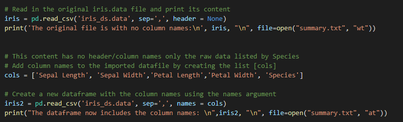
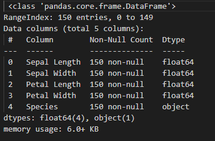
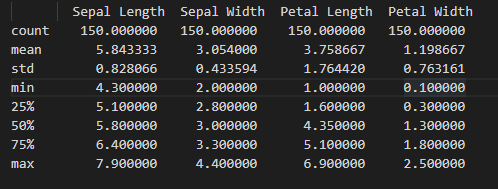
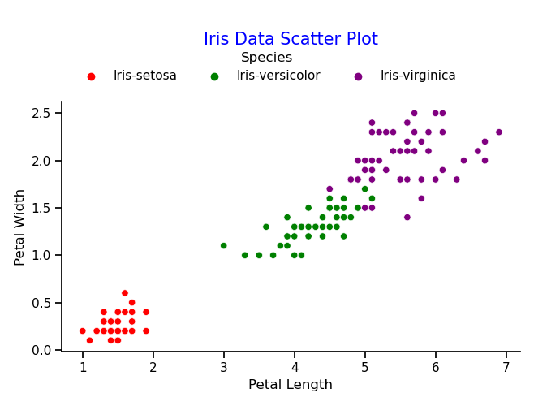
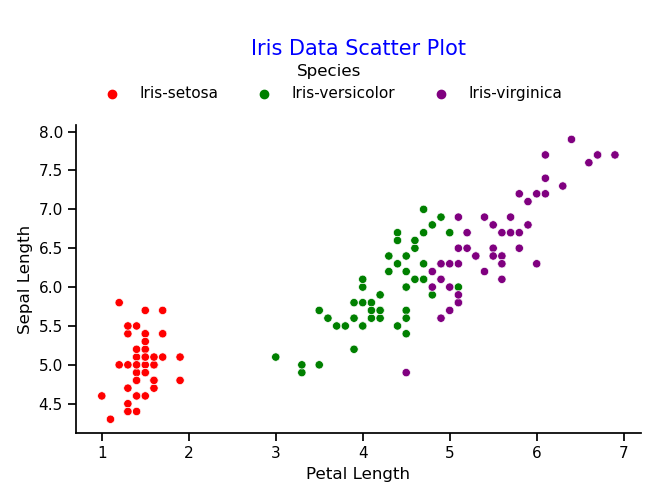
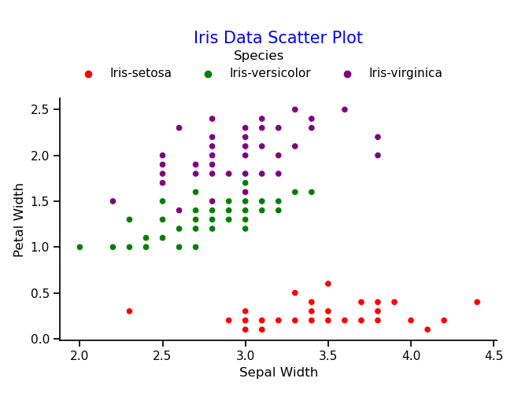
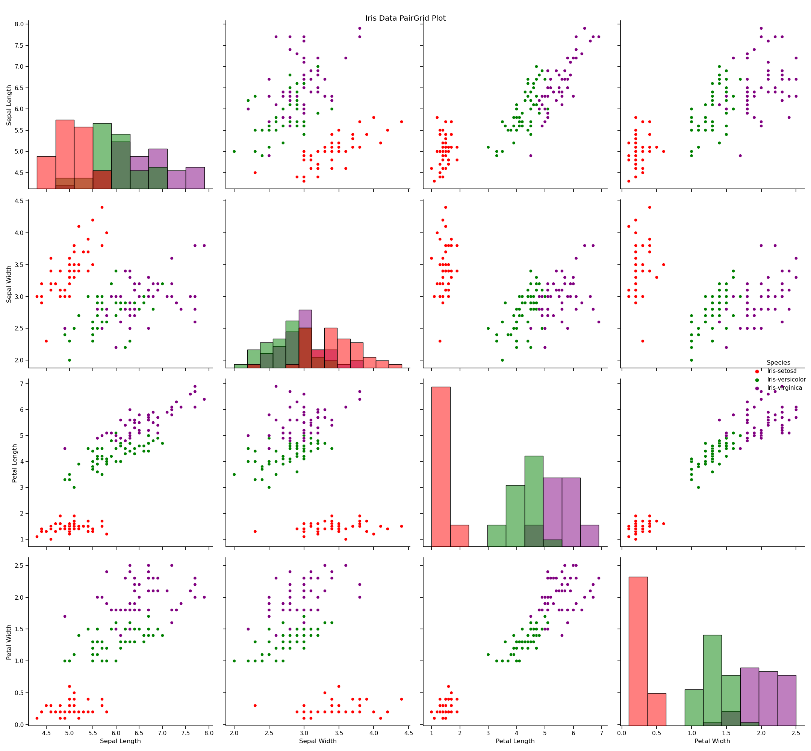
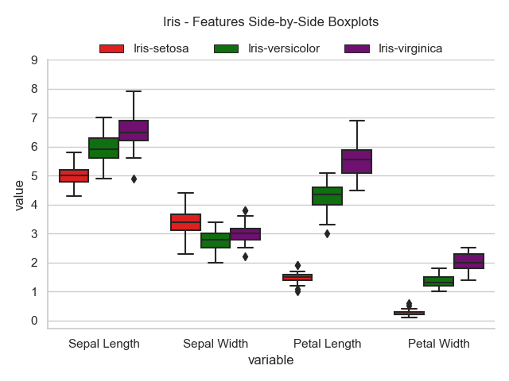
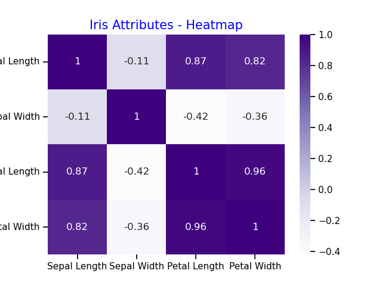

# R.A.Fisher's Iris Dataset Programming and Scripting Project

## *Eva Czeyda-Pommersheim / April 2022*

---

## Investigation and analysis of the Iris Dataset

I. INTRODUCTION

Sir Ronlad Aymler Fisher was a British polymath and biologist, an academic person working in multiple fields of science such as mathematics, statistics, genetics.

The Iris Dataset was analyzed by R.A.Fisher in 1936 in his article called "The use of multiple measurements in taxonomic problems".  
In this article, R.A.Fisher developed and evaluated a linear function to differentiate Iris species based on the morphology of their flowers. It was the first time that the sepal and petal measures of the three Iris species as mentioned above appeared publicly.Ref [The Iris Dataset — A Little Bit of History and Biology](https://towardsdatascience.com/the-iris-dataset-a-little-bit-of-history-and-biology-fb4812f5a7b5)

The Iris dataset is one of the first historical datasets used for multivariate data analysis.

The dataset consists of 50 samples of 3 different types of the Iris flower (Iris-setosa, Iris-Versicolour and Iris-Virginica). Each sample is described based on 4 features (sepal length, sepal width, petal length and petal width), all four features measured in cm-s.

The dataset has been analyzed by multiple papers. It is a simple enough dataset which can be, and is commonly used to understand concepts of data analytics and machine learning. The dataset allows to understand concepts of determining similarities and differences of certain variables, in this case the three flower species and their dimensions. Statistical analysis of the data may be used for classification, prediction, modelling purposes. The data can be presented in various ways to allow conclusions to be drawn using the variables/features and utilize the outcomes to reflect on the three species or even to predict the class of a newly discovered Iris flower.

    
    

II. INVESTIGATION

1. PYTHON LIBRARIES

The following python libraries were used to complete this project.

__Pandas:__ 
The name "Pandas" has a reference to both "Panel Data", and "Python Data Analysis" and was created by Wes McKinney in 2008. Pandas allows us to analyze big data and make conclusions based on statistical theories. Pandas can clean messy data sets, and make them readable and relevant. Ref [Panda Intro](https://www.w3schools.com/python/pandas/pandas_intro.asp). It is useful to display the dataset, analyze different variables in the dataset, calculate the mean, min, max values, standard deviation and correlation between variables.

__Matplotlib:__ 
Matplotlib is a comprehensive library for creating static, animated, and interactive visualizations in Python. Matplotlib makes easy things easy and hard things possible.Ref [Matplotlib:Visualization with Python](https://matplotlib.org/)

__Seaborn:__ 
Seaborn is a library for making statistical graphics in Python. It builds on top of matplotlib and integrates closely with pandas data structures.
Seaborn helps you explore and understand your data. Its plotting functions operate on dataframes and arrays containing whole datasets and internally perform the necessary semantic mapping and statistical aggregation to produce informative plots. Ref [An Introduction to seaborn](https://seaborn.pydata.org/introduction.html)

__Numpy:__ 
NumPy is a Python library used for working with arrays.
It also has functions for working in domain of linear algebra, fourier transform, and matrices.
NumPy was created in 2005 by Travis Oliphant. It is an open source project and you can use it freely.
NumPy stands for Numerical Python. Ref [What is NumPy](https://www.w3schools.com/python/numpy/numpy_intro.asp#:~:text=NumPy%20is%20a%20Python%20library,you%20can%20use%20it%20freely.)
  
2. IMPORTING THE IRIS DATASET 

The dataset was downloaded from Ref [UCI Machine Learning Repository](https://archive.ics.uci.edu/ml/datasets/iris) as iris.data file. This file is with a .data extension which is commonly used for storing datasets. Python's Pandas library command read_csv provides a solution to convert read this file as a CSV (Comma separated file). 
When reading the file in its original version it was noted that the columns have no headers/names.
Based on the attribute data as per names.data file also available @ Ref [UCI Machine Learning Repository](https://archive.ics.uci.edu/ml/datasets/iris) a list [cols] was created and added to the file under a new dataframe called iris2. 

3. ANALYZING THE DATASET 

Summary.txt file available in this repository contains a detailed review of the dataframe itself using generic commands available in the python Pandas package which provides with numerous ways to review and interpret the dataset as well as differentiate between the four features by the three species of the Iris flower. 

Execution of the df.info() function details were obtained about the dataset. There are 4 float data types (features) and 1 object type (species). There are 150 datapoints (50 for each feature across the 3 species of the Iris flower) with no null values in the dataset. 

The df.describe() function allows an in depth review of the mean, standrad deviation, min, max and percentile values for each feature. The datapoints for Sepal length and width show a smaller standard deviation realtive to the mean, compared to datapoints for Petal length and width. This is also reflected in the median values (50% percentile). Median values for the Petal dimensions are father away from the mean values, indicating a larger spread/distribution of the data points with potential outliers. It will also become evident when reviewing the visual presentation of the data. 

The Sepal dimensions are larger compared to the Petal dimensions in general. This is most visible in the case of the Iris_setosa species. It clearly stands out and can be separated from the other two species when comparing the attribute variables. 

The following source was used to redirect all commands into one single file called summary.txt. [Ref [Write command line output to a file](https://stackoverflow.com/questions/9003522/writing-command-line-output-to-file#:~:text=After%20that%20you%20can%20simple,functions%3A%20File%20IO%20in%20python.&text=is%20not%20useful-,Show%20activity%20on%20this%20post.,writing%2C%20and%20a%20for%20appending)]

4. VISUALIZATION 

A lot of the data included in [summary.txt](/pands-project/summary.txt) can be represented in a graphical way also. Python libraries utilized in this visualization attempt were Matplotlib and Seaborn. Seaborn is built upon Matplotlib and is widely used for representing data in a highly efficient manner. The approach followed in this project is included and detailed in the file [visual.py](/pands-project/visual.py). 
Historgrams were used to plot each variable (feature): Sepal Length, Sepal Width, Petal Length and Petal width. Histograms provide information about the distribution of the datapoints for each feature. As detailed under Chapter 3 the spread for the Petal dimensions are slightly wider compared to the Sepal dimensions.  
Initially each histogram was plotted on individual plots, and the pictures of each histogram can be found in this Github repository. However, during the completion of the project I found a way to plot all four histograms using subplotting and initial blocks of code were commented out in the [visual.py](/pands-project/visual.py) file. See final single image of the four histograms under [Histogram_by_features.png](/pands-project/Histogram_by%20features.png).  

 

The plots allow to determine the dimensions of each feature and the most frequent values they occure with, but as some of the data do not prove to be following a normal distribution it is not easy to determine the mean values or the standard deviation for each feature based on these plots. In addition, the historgrams do not provide a breakdown of the species on the individual graphs. 

Although individual scatter plots were also generated to examine the distribution of the datapoints by differentiating between the species of the flowers. The PairGrid option in Seaborn allowed a more efficient presentation of all datapoints on scatterplots as well as distribution plots (Histograms) diagonally.

  

 

The plots show that the Iris-Setosa datapoints are isolated compared to the other two species. Both petal length and petal width for Iris-setosa show significantly smaller dimensions compared to Iris-Versicolor and Iris-Virginica. On this pairgrid additional insight is gained to the histograms (diagonal plots for each feature). The red colour for Iris Setosa accumulates in the lower range of values for all features except for Sepal Width where it seems have a higher spread of values, in the higher end of the value range. The histograms also show Iris-setosa petal dimensions are isolated from the other two species and only very little overlap is present between Iris-versicolor and Iris-virginica. 

Box plots present a more complex way to visualize data and consequently can tell more information about each feature and flower species. Boxplots detail the minimum and maximum values of the datapoints in each distribution, the 25th, 50th (Median) and 75th percentile and also give indication about any outliers in the distribution.
Boxplots are presented two different ways. The first presentation is by an individual plot for each feature (Sepal Length, Sepal Width, Petal Length and Petal With.) by the three species.

  
  

The second presentation is on one joint plot where features are plotted on the x axis against its numerical values, differentiated by legend colours for the species. This allows the comparison of each feature by species on the same scale.

 

On review of the boxplots for each feature by flower species, it is evident that based on petal length and width, it would be very easy to conclude if a flower is Iris Setosa. It would prove slightly more difficult to differentiate between Iris-Versicolor and Iris-Virginica based on the petal length values as there is still some overlap across the distribution of the datapoints, however conclusions coudl still be drwan with a high enough ocnfidence level. 
Sepal dimensions have a much smaller range of values and therefore overlap a lot across all three species. Consequently, sepal features would not be suitable to be used for classification purposes. 

Finally, correlation was also assessed. Correlation is commonly used for prediction purposes. A heatmap was prepared to visualize the correlation values, which were already detailed in the summary.txt file. 

The scale on the right hand side of the heatmap indicates the colour scale of the correlation value, the closer it is to the value of 1 the stronger the correlation between the features is. Sepal width clearly shows no correlation with any of the other features. There seems to be stonger correlation between Sepal length and Petal Length/Petal Width as well as Petal Length and Petal Width.
This heatmap, however, would need to be further assessed in order to understand the true correlation between features by flower species as changes in one feature may not necesarily result in changes in the other feature. Their correlation may be related to other components that are not discussed by this dataset. 

5. CONCLUSIONS 

This dataset developed and discussed in R.A Fisher's paper is a simple dataseet and is commonly used for learning purposes to understand the concepts of data analytics. It is also used as good example for machine learning purposes. It can be freely downloaded from the internet and also is part of the in built datasets in SKlearn and in Seaborn Libraries.
This dataset would have been studied by numerous people for various academic purposes, and to practice coding in data analytics. 

Using the graphical representation of the data in section 4 conclusion can be drawn that Iris-Setosa has significantly smaller petal dimensions. If data was to be used to determine the species of a newly found flower the boxplots clearly determine that if the petal length of the flower is below 2 cm, or if the value of petal width is below 1 cm we can be certain that it is an Iris-Setosa. The best feature to determine the Iris flower type remains to be the Petal length as it allows to differenciate between Iris-versicolor and Iris-virginica. Any values between 2.0cm-4.5cm can confidently be deemed as Iris-versicolor and any petal length dimension greater than 5.0cm can be considered an Iris-virginica. 
The sepal dimensions however are not that straight forward and further tools would need to be utilized, such as the k-nearest neighbour algorithm, in Machine Learning to be able to make more reliable predictions over the classification of future flowers. 

6. LIST OF FILES in REPOSITORY

- [analysis.py](/pands-project/analysis.py)
- [visual.py](/pands-project/visual.py)
- [iris2.info.png](/pands-project/iris2.info.png)
- [iris2.describe.png](/pands-project/iris2.describe.png)
- [Historgram_by_features.png](/pands-project/Histogram_by%20features.png)
- [Hist_petal_length.png](/pands-project/Hist_petal_length.png)
- [Hist_petal_width.png](/pands-project/Hist_petal_width.png)
- [Hist_sepal_length.png](/pands-project/Hist_sepal_length.png)
- [Hist_sepal_width.png](/pands-project/Hist_sepal_width.png)
- [Iris_ScatterPlot1.png](/pands-project\Iris_ScatterPlot1.png)
- [Iris_ScatterPlot2.png](/pands-project\Iris_ScatterPlot2.png)
- [Iris_ScatterPlot3.png](/pands-project\Iris_ScatterPlot3.png)
- [Iris_ScatterPlot4.png](/pands-project\Iris_ScatterPlot4.png)
- [Iris_Features_PairPlot.png](/pands-project/Iris_Features_PairPlot.png)
- [Boxplot_Petal Length.png](/pands-project/Boxplot_Petal%20Length.png)
- [Boxplot_Petal Width.png](/pands-project/Boxplot_Petal%20Width.png)
- [Boxplot_Sepal Length.png](/pands-project/Boxplot_Sepal%20Length.png)
- [Boxplot_Sepal Length.png](/pands-project/Boxplot_Sepal%20Width.png)
- [Iris_SidebySide_Boxplot.png](/pands-project/Iris_SidebySide_Boxplot.png)
- [Iris_Heatmap.png](/pands-project/Iris_Heatmap.png)
- [Images_irisflower.png](/pands-project/Images_irisflower.png)
- [iris_ds.data](/pands-project/iris_ds.data)
- [iris2.csv](/pands-project/iris2.csv)
- [summary.txt](/pands-project/summary.txt)
- [README.md]

### *__III. REFERENCES:__*

- The Iris Dataset — A Little Bit of History and Biology, Available at:[https://towardsdatascience.com/the-iris-dataset-a-little-bit-of-history-and-biology-fb4812f5a7b5]
- Wikipedia (2022), Iris Flower Dataset,From Wikipedia, the free encyclopedia, Available at:[https://en.wikipedia.org/wiki/Iris_flower_data_set]
- Wikipedia (2022), Ronald Fisher, From Wikipedia, the free encyclopedia,  Available at:[https://en.wikipedia.org/wiki/Ronald_Fisher]
- Science Direct (2019), Vijay Kotu, Bala Deshpande - Virginica Data Exploration, Data Science (Second Edition), 2019, Available at: [https://www.sciencedirect.com/topics/mathematics/virginica][https://ars.els-cdn.com/content/image/3-s2.0-B9780128147610000034-f03-01-9780128147610.jpg]
- Medium@Nivitus (2020), Iris Flower Classification - Machine Learning, Available at:[https://medium.com/@Nivitus./iris-flower-classification-machine-learning-d4e337140fa4]
- Pandas (2022), Panda Intro, © Copyright 2008-2022, the pandas development team, Available at:[https://www.w3schools.com/python/pandas/pandas_intro.asp]
- Matplotlib:Visualization with Python[https://matplotlib.org/]
- Seaborn, An Introduction to seaborn, © Copyright 2012-2021, Michael Waskom, Available at:[https://seaborn.pydata.org/introduction.html]
- W3SChools, What is NumPy[https://www.w3schools.com/python/numpy/numpy_intro.asp#:~:text=NumPy%20is%20a%20Python%20library,you%20can%20use%20it%20freely.]
- UCI Machine Learning Repository, Available at: [https://archive.ics.uci.edu/ml/datasets/iris]
- AnalyticsVidha (kunal-2015), Scikit-learn(sklearn) in Python – the most important Machine Learning tool I learnt last year!, © Copyright 2013-2022 Analytics Vidhya, Available at: [https://www.analyticsvidhya.com/blog/2015/01/scikit-learn-python-machine-learning-tool/]
- Great Learning (2020), Working With Iris.csv | Iris Data Set In Less Than 10 minutes, Available at:[https://www.youtube.com/watch?v=HXi9cl5Aq5w]
- Joe James (2021), Python Data Analysis with Iris Dataset | Data Science, plotting & graphing, Available at:[https://www.youtube.com/watch?v=02BFXhPQWHQ]
- Hackers Realm (2020), Iris Dataset Analysis (Classification) | Machine Learning | Python, Available at:[https://www.youtube.com/watch?v=pTjsr_0YWas]
- Make a header row in csv file [https://www.techwalla.com/articles/how-to-make-a-header-row-in-a-csv-file]
- StackOverflow, Write command line output to a file, Available at:[https://stackoverflow.com/questions/9003522/writing-command-line-output-to-file#:~:text=After%20that%20you%20can%20simple,functions%3A%20File%20IO%20in%20python.&text=is%20not%20useful-,Show%20activity%20on%20this%20post.,writing%2C%20and%20a%20for%20appending].
- GeeksforGeeks (2022), Exploratory Data Analysis on Iris Dataset, 26 Apr, 2022, GeeksforGeeks.org Available at:[https://www.geeksforgeeks.org/exploratory-data-analysis-on-iris-dataset/]
- StackOverflow, Centering image on ReadMe.md file, Available at:[https://stackoverflow.com/questions/12090472/how-do-i-center-an-image-in-the-readme-md-file-on-github]
- Seaborn (2021), © Copyright 2012-2021, Michael Waskom, Available at:[https://seaborn.pydata.org/generated/seaborn.move_legend.html?highlight=move%20legend#seaborn.move_legend]
- Seaborn (2021), seaborn.FacetGrid, © Copyright 2012-2021, Michael Waskom,Available at: [https://seaborn.pydata.org/generated/seaborn.FacetGrid.html]
- Pandas (2022), © Copyright 2008-2022, the pandas development team, Available at:[https://pandas.pydata.org/docs/reference/api/pandas.melt.html]
- Sivakar Sivarajah (2020), Most Important Pandas Functions-Full Tutorial, 
Towards Data Science, Available at: [https://towardsdatascience.com/pandas-full-tutorial-on-a-single-dataset-4aa43461e1e2]
- Hillary Nyakundi (2021), How to Write a Good README File for Your GitHub Project, freeCodeCamp, Available at: [https://www.freecodecamp.org/news/how-to-write-a-good-readme-file/]
- StackOverflow, Available at: [https://stackoverflow.com/questions/25068384/bbox-to-anchor-and-loc-in-matplotlib]
- StackOverflow, Available at: [https://stackoverflow.com/questions/64192059/using-a-for-loop-to-create-three-adjacent-box-plots-for-each-of-the-numeric-vari]
- StackOverflow, Available at: [https://stackoverflow.com/questions/37734512/savefig-loop-adds-previous-plots-to-figure]