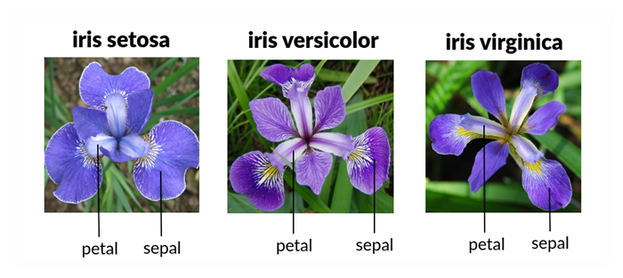

# R.A.Fisher's Iris Dataset Programming and Scripting Project

## *Eva Czeyda-Pommersheim / April 2022*

---

## Investigation and analysis of the Iris Dataset

I. INTRODUCTION

Sir Ronlad Aymler Fisher was a British polymath and biologist, an academic person working in multiple fields of science such as mathematics, statistics, genetics.

The Iris Dataset was analyzed by R.A.Fisher in 1936 in his article called "The use of multiple measurements in taxonomic problems".  
In this article, R.A.Fisher developed and evaluated a linear function to differentiate Iris species based on the morphology of their flowers. It was the first time that the sepal and petal measures of the three Iris species as mentioned above appeared publicly.Ref [The Iris Dataset — A Little Bit of History and Biology](https://towardsdatascience.com/the-iris-dataset-a-little-bit-of-history-and-biology-fb4812f5a7b5)

The Iris dataset is one of the first historical datasets used for multivariate data analysis.

The dataset consists of 50 samples of 3 different types of the Iris flower (Iris-setosa, Iris-Versicolour and Iris-Virginica). Each sample is described based on 4 features (sepal length, sepal width, petal length and petal width), all four features measured in cm-s.

The dataset has been analyzed by multiple papers. It is a simple enough dataset which can be, and is commonly used to understand concepts of data analytics and machine learning. The dataset allows to understand concepts of determining similarities and differences of certain variables, in this case the three flower species and their dimensions. Statistical analysis of the data may be used for classification, prediction, modelling purposes. The data can be presented in various ways to allow conclusions to be drawn using the variables/features and utilize the outcomes to reflect on the three species or even to predict the class of a newly discovered Iris flower.

II. INVESTIGATION

1. PYTHON LIBRARIES

The following python libraries were used to complete this project.

__Pandas:__ 
The name "Pandas" has a reference to both "Panel Data", and "Python Data Analysis" and was created by Wes McKinney in 2008. Pandas allows us to analyze big data and make conclusions based on statistical theories. Pandas can clean messy data sets, and make them readable and relevant. Ref [Panda Intro](https://www.w3schools.com/python/pandas/pandas_intro.asp). It is useful to display the dataset, analyze different variables in the dataset, calculate the mean, min, max values, standard deviation and correlation between variables.

__Matplotlib:__ 
Matplotlib is a comprehensive library for creating static, animated, and interactive visualizations in Python. Matplotlib makes easy things easy and hard things possible.Ref [Matplotlib:Visualization with Python](https://matplotlib.org/)

__Seaborn:__ 
Seaborn is a library for making statistical graphics in Python. It builds on top of matplotlib and integrates closely with pandas data structures.
Seaborn helps you explore and understand your data. Its plotting functions operate on dataframes and arrays containing whole datasets and internally perform the necessary semantic mapping and statistical aggregation to produce informative plots. Ref [An Introduction to seaborn](https://seaborn.pydata.org/introduction.html)

__Numpy:__ 
NumPy is a Python library used for working with arrays.
It also has functions for working in domain of linear algebra, fourier transform, and matrices.
NumPy was created in 2005 by Travis Oliphant. It is an open source project and you can use it freely.
NumPy stands for Numerical Python. Ref [What is NumPy](https://www.w3schools.com/python/numpy/numpy_intro.asp#:~:text=NumPy%20is%20a%20Python%20library,you%20can%20use%20it%20freely.)
  
2. IMPORTING THE IRIS DATASET 
3. ANALYZING THE DATASET 
4. VISUALIZATION 
5. CONCLUSIONS 
6. LIST OF FILES in REPOSITORY

### *__III. REFERENCES:__*

- The Iris Dataset — A Little Bit of History and Biology [https://towardsdatascience.com/the-iris-dataset-a-little-bit-of-history-and-biology-fb4812f5a7b5]
- The Iris Flower Dataset [https://en.wikipedia.org/wiki/Iris_flower_data_set]
- Ronald Fisher [https://en.wikipedia.org/wiki/Ronald_Fisher]
- Science Direct - Virginica [https://www.sciencedirect.com/topics/mathematics/virginica][https://ars.els-cdn.com/content/image/3-s2.0-B9780128147610000034-f03-01-9780128147610.jpg]
- Iris Flower Classification - Machine Learning [https://medium.com/@Nivitus./iris-flower-classification-machine-learning-d4e337140fa4]
- Panda Intro[https://www.w3schools.com/python/pandas/pandas_intro.asp]
- Matplotlib:Visualization with Python[https://matplotlib.org/]
- An Introduction to seaborn[https://seaborn.pydata.org/introduction.html]
- What is NumPy[https://www.w3schools.com/python/numpy/numpy_intro.asp#:~:text=NumPy%20is%20a%20Python%20library,you%20can%20use%20it%20freely.]
- <https://www.analyticsvidhya.com/blog/2015/01/scikit-learn-python-machine-learning-tool/>
- <https://www.youtube.com/watch?v=HXi9cl5Aq5w>
- <https://www.youtube.com/watch?v=02BFXhPQWHQ>
- <https://www.youtube.com/watch?v=pTjsr_0YWas>
- <https://www.techwalla.com/articles/how-to-make-a-header-row-in-a-csv-file>
